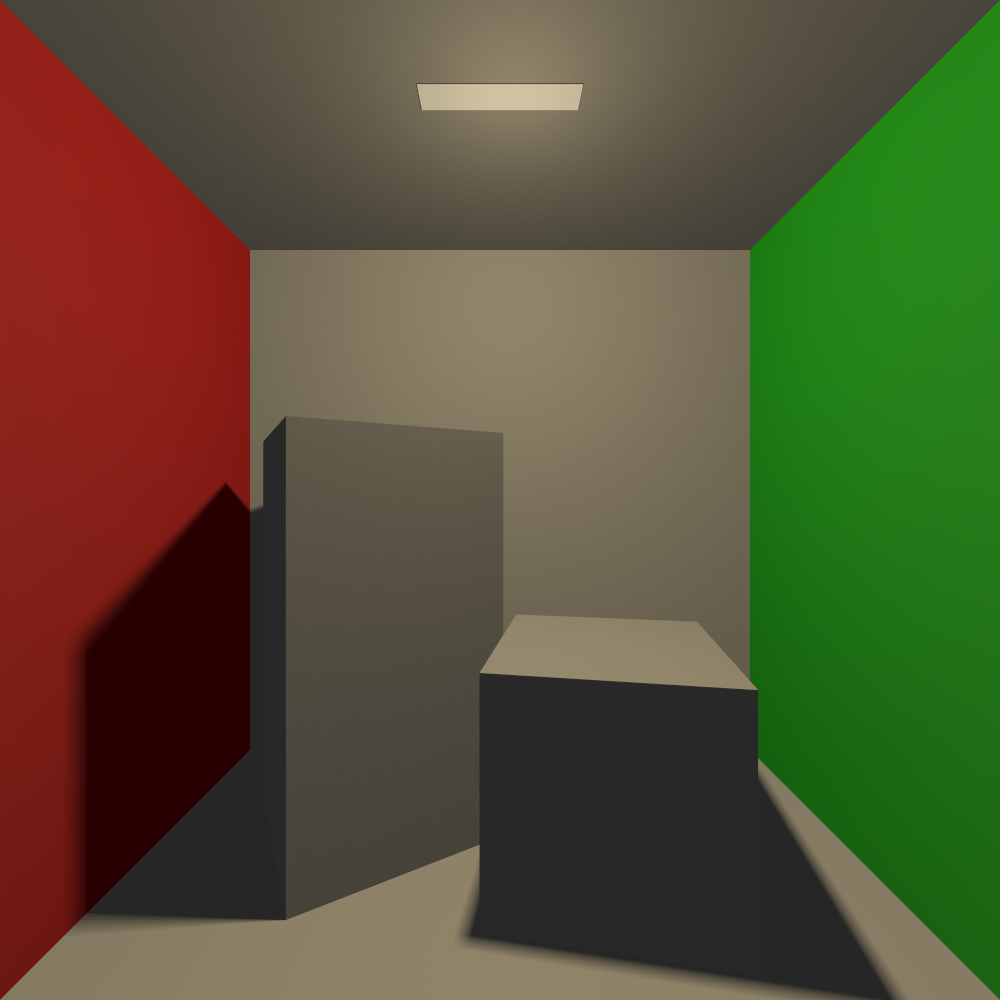
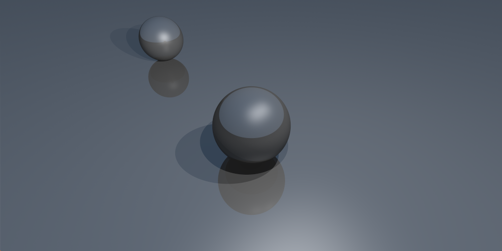
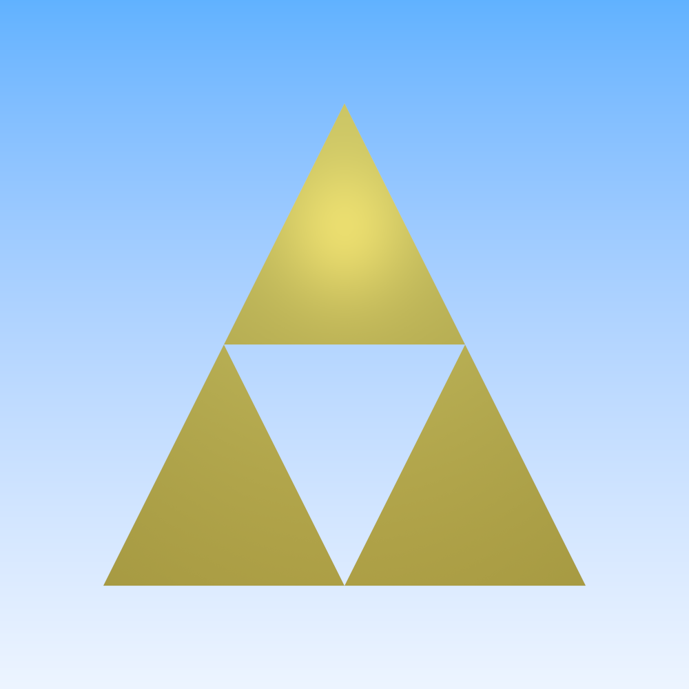
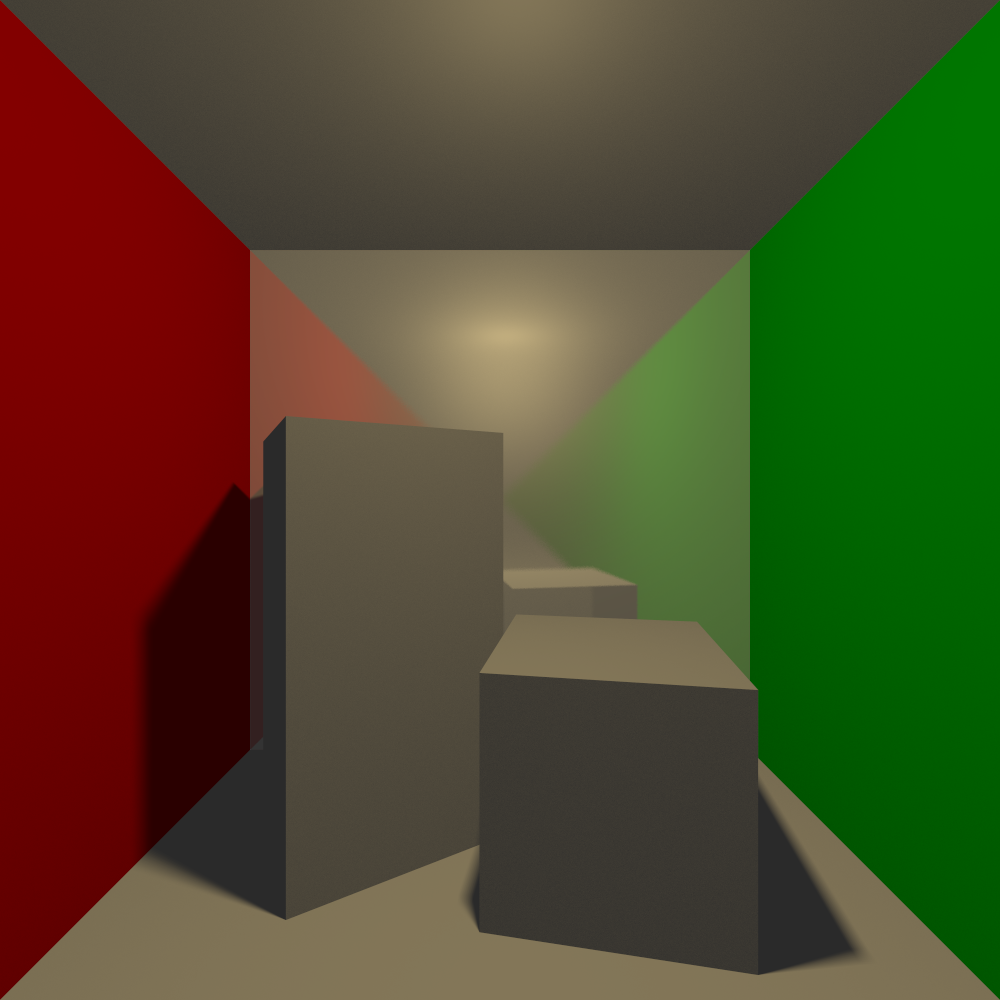

```
  __________    _____ _____.___._______
  \______   \  /  _  \\__  |   |\      \
   |       _/ /  /_\  \/   |   |/   |   \
   |    |   \/    |    \____   /    |    \
   |____|_  /\____|__  / ______\____|__  /
          \/         \/\/              \/
         A ray tracer built by @ejrbuss
```



# Introduction

`Rayn` is a toy race tracer developed as a learning excercise for CSC 305 at
the University of Victoria.

## Building

`Rayn`'s library files are all header only so you only need to compile
`rayn.cpp`. To build `Rayn` with debugging support on windows run

```
> build.bat
```

If you want optimizations turned on, run:

```
> build-opt.bat
```

On Linux run
```
$ g++ -I . -std=c++11 -o rayn .\rayn.cpp
```

## Using the Command Line

`Rayn`'s usage looks like:

```
$ ./rayn [options]
```

The following options are available.

### `--format (-f) [format]`
Set the output format (either bmp or ppm)

### `--out (-o) [path]`
Set the output file path

### `--shader (-s) [shader]`
Set the shader to render with. Either *normal*, *scatter*, or *phong*.

### `--scene (-S) [scene]`
Set the scene to render. Scenes include *box-scene*. See
`lib/data/scene.hpp` for more details.

### `--aa (-a) [algorithm]`
Set the anti-aliasing algorithm. Either *none*, *centered*, or some level
of *SSAA* (*4xSSAA, 8xSSAA, 16xSSAA, 32xSSAA, 64xSSAA*).

### `--fov (-v) [degress]`
Set the vertical field of view in degrees.

### `--camera (-c) [from] [to] [vup]`
Set the camera position by providing three vectors in the
form x,y,z. The first vector is the camera position. The
second vector is where the camera is pointing. The third
vector is the relative up position of the camera.

### `--resolution (-r) [widthxheight]`
Set the resolution of the render image in the format
*widthxheight*.

### `--preview (-p)`
Enable preview images. This will render an image to
`preview.bmp` or `preview.ppm` at a low resolution and
without anti aliasing in order to preview the rendering job.

### `--debug (-d)`
Enable debug messages. Shows configuration and rendering
progress.

## Features

`Rayn` implements the following features:

 - Can render spheres, planes, triangles, and quads
 - Can render scenes using a three different shaders
    - Normal maps
    - Scatter shading
    - Phong shading
 - Provides a set of premade scenes including a Cornell Box Scene
 - Can render from an arbitrary view point
 - Can estimate area lighting effects
 - Provides various levels of anti-aliasing

## Example Images



`$ ./rayn -s phong -S scene1 -c -2,2,0 0,0,-1 0,1,0 -v 60`

Example of arbitrary camera positioning, multiple point
lights, and reflections



`$ ./rayn -s phong -S triforce -v 110`

Example of rendering triangles



`$ ./rayn -s phong -S box-scene`

Alternate box scene with approximated soft shadows and
reflections

# Design

The core design of `Rayn` follows the outline set out in
*Ray Tracing in one weekend* [1], but abstracts a number
of additional design elements out. Because this is the first
time I have used C++ I decided to avoid heavy Object Oriented
code, instead opting for immutable data structures and
functions. The first iteration of `Rayn` in fact had no
classes, only structs and related functions, held in a
namespace of the same name. This design was iterated on
to introduce classes as a convenience, but the original
design's influence can still be seen in the large number
of namespace functions (particularly factory functions) for
many of the data structures.

Rather than sub classing structures for different behaviors
the choice was made to use lambdas. This had to do with a
level of comfort, I am used to languages like Scala,
JavaScript, and python where first order functions on common
place, but also to avoid memory management problems.
`new` appears nowhere in this codebase and instead everything
is stack allocated or captured by lambdas.

In addition to the data structures described below I
developed a couple of supplemental structures, including
one for parsing arguments (`lib/util/argparser.hpp`) that
helped make developing `rayn` less painful. In particular
the ability to preview slow rendering images was extremely
valuable to know if an hour plus long rendering period was
worth the wait.

## Data Structures

Data structures are broken into two categories `data` and
`render`. The data structures are meant to be purely data
oriented with little to know behavior. Methods are meant to
help with jumping between types. The main exception to this
is `lib/data/buffer` which implements a great deal of behavior
including exporting options. This is an artifact of the
project's development history, and given more time I would
change its implementation.

### Color

used to store color data. Primarily this class provides
methods for creating color either from floats, vec3s,
or integers. Additionally some color correction is done
during construction for float based colors.

 - `r` the red channel
 - `g` the green channel
 - `b` the blue channel
 - `str()` output the color as a string (used for outputting
 in the ppm format as well as for debugging)
 - `bytes()` output the color as a series of bytes in
 little-endian format

### Buffer

Used to store pixel data. Data is stored as a vector of `Color`s. This avoids having to manually manage memory. The
buffer's dimensions (width and height) correspond to the
rendering resolution.

 - `width` the buffer's width
 - `height` the buffer's height
 - `get(x, y) -> Color` get the color of a particular pixel
 - `set(x, y, Color)` set the color of a particular pixel
 - `each(fn)` iterate over each pixel given its coordinates
 - `map(fn)` map each pixel to a new color given its
 coordinates
 - `ppm(path)` export the buffer in the ppm format
 - `bmp(path)` export the buffer in the bmp format

### Resolution

A helper class for keeping information about the rendering
resolution.

 - `width` the resolution width
 - `height` the resolution height
 - `aspect` the resolution's aspect ratio

### Camera

A container class which calculates the ray tracer's screen
position and dimensions given a set of parameters. This is
used to set arbitrary viewpoints. This is achieved by
creating an orthonormal basis to put the camera on (a set
of vectors u, v, and w to use instead of x, y, and z).

 - `origin` the camera origin or position
 - `llc` the lower left hand corner of the screen
 - `hrz` the horizontal edge of the screen from the `llc`
 - `vrt` the vertical edge of the screen from the `llc`

### Camera View

A helper class for building `Camera`s.

- `from` where the camera is looking from
- `to` where the camera is looking
- `vup` the relative "up direction"
- `camera(fov, aspect)` create a camera instance

### Ray

The core of the ray tracer. The Ray is a set of two vector's
Which define a directed axis in space. Rays are used to
intersect the camera and the screen as well as bodies in the
scene. The ray provides a helper method `at` which is
typically used to calculate where an intersection actually
occurred.

 - `origin` the ray's origin
 - `direction` the ray's direction
 - `at(t)` the end point of the ray if of length t

### Material

A grab bag of constants associated with bodies which are
used by the shaders to determine a pixel's color.

 - `amb` the body's ambient attenuation
 - `diff` the body's diffuse attenuation
 - `spec` the body's specular attenuation
 - `refl` the body's reflective attenuation
 - `specpow` the power of the body's specular (how narrow
 the specular will appear)
 - `fuzz` how "bumpy" the surface should be considered, used
 in diffuse and reflection calculations

### Intersection

Used to encode information about an intersection between
a ray and a body.

 - `t` the length of the ray at the intersection
 - `point` the point of intersection
 - `normal` the normal to the intersection (normalized)
 - `material` the material at the intersection

### Scene

Scenes are a collection of bodies and lights to be used
when rendered. They provide an easy way of switching and
maintaining different sets of geometries. This file is not
particular well-kept as it undergoes constant modification.

 - `bodies` a vector of bodies contained by the scene
 - `lights` a vector of lights contained by the scene
 - `world` an aggregated body containing `bodies`
 - `name` the name of the scene for command line lookup

## Rendering Structues

The rendering structures implement the core behavior of
the ray tracer and use the data classes in their
calculations.

### Anti-Aliasing

The `AA` class provides a function that can be applied to a
buffer's `map` method. When supplied a shader function the
given `AA` instance will determine how a pixel is sampled.
For instance for `normal` anti-aliasing the instance acts
as a middleman and just passed the buffer coordinates
straight to the shader. For `SSAA` anti-aliasing however
pixels are subdivided based of the level of anti-aliasing
desired, and then an off centered diamond pattern is used
for sampling. This helps create a smoother final image even
with just 4 samples and produces better results than when
compared to random sampling. The pattern is based off
[this](https://www.beyond3d.com/content/articles/122) article from the legendary Durante [2].

### Bodies

Bodies provide the code for calculating when a ray intersects
a piece of geometry. These are implemented as lambdas held by
the Body class. In this way their factory functions act as
virtual higher order functions. Four body types are provided.

#### Spheres

Intersection with spheres is a relatively easy calculation
that can be derived directly from the sphere equation:

> *x^2 + y^2 + z^2 = R^2*

The derivation of sphere-ray intersection is presented in
both *Ray Tracing in One Weekend* [1] and the
*Fundamentals of Computer Graphics 3rd Edition* [3].

#### Planes

Intersection with planes is also straightforward. Because
the dot product projects one vector onto another, the normal
of the plane can be used to calculate the point of
intersection.

> *t = p - ro • N / rd • N*

Where *p* is any point on the plane. Because planes are
infinite this equation will only not have a solution if
the ray is parallel ie.

> *rd • N = 0*

#### Triangles

Intersection with triangles can be done using barycentric
coordinates. This was explored during this course lab
section. A ray intersects with a triangle if the sum
of areas of a point and its vertices over the area of that
triangle sum to less than 1. Within the code the area of the
triangle and sub triangle is not used, instead twice the area
is as this is simply

> *2Area = AB x AC*

And the relative ratios remain the same.

#### Quads

Intersection with quads is very similar to intersection
with planes except for the additional step of checking
bounds. This can be done by projecting the ray's position
onto the plane and then just checking if it is within the
provided vertices. This is done in the code using the dot
product, as there is no need to take the square root so
long as the bounds being check are also dotted with
themselves.

### Shaders

Three shaders are provided for determine pixel colors. The
primary shader of interest however is the phong shader as it
implements the light model discussed in class and the
textbook [3].

#### Normal

Convers an intersection points normal x,y,z into
r,g,b values. This is primarily used for debugging, for
instance checking if a quad is oriented such that its normal
faces away from the camera resulting in improper shading.

#### Scatter

The scatter shader implements a similar shading scheme to the
once discussed in *Ray Tracing in One Weekend* however it
differs in that it lacks the same Material implementation.
Instead some of the phong parameters are used to approximate
similar effects. This shader only implements Lambertian
(diffuse) and reflective surfaces. Additionally it uses an
implicit light model, thus ignoring scene lights.

#### Phong

The phong light model uses four color components to shade a
pixel, ambient, diffuse, specular, and reflection. Ambient
and reflection are calculated once per sample, however
diffuse and specular are calculated once per light source. All
of these values are summed to calculate the pixel color. The
full equation is shown below.

> *Color = Ag Ma + Ip Md cosθ + Ip Ms N • Mp + Mr Color(refl)*

Additionally the diffuse and reflection calculation receive
a fuzz factor. This is in the form of a random vector within
the unit circle multiplied by a small constant, applied to
their normals. This is used to simulate surface roughness.
Additionally for small light differentials it causes some
dithering preventing gradient banding.

Lambertian (diffuse) materials are implemented by providing
color values to ambient and diffuse constants, and relatively
low specular, reflection, and specular power constants. Some
fuzz is added to smooth gradients. Some reflection can be
added to create a slightly different look, however this has
major performance impacts due to the recursion.

Metals and other reflective materials can be simulated simply
by setting higher specular, reflective, and specular power
constants.

Dialectic (refractive) materials are not implemented by
`Rayn`. Utility methods for calculating the refracted Vector
are provided but are not used. Implementing refractive
materials would require using these rays in a similar
recursive manner as the reflective ones.

# References

[1] Ray Tracing in One Weekend by Peter Shirley

[2] Diving Into Anti-Aliasing by Peter Thoman

[3] Fundamentals of Computer Graphics 3rd Edition

